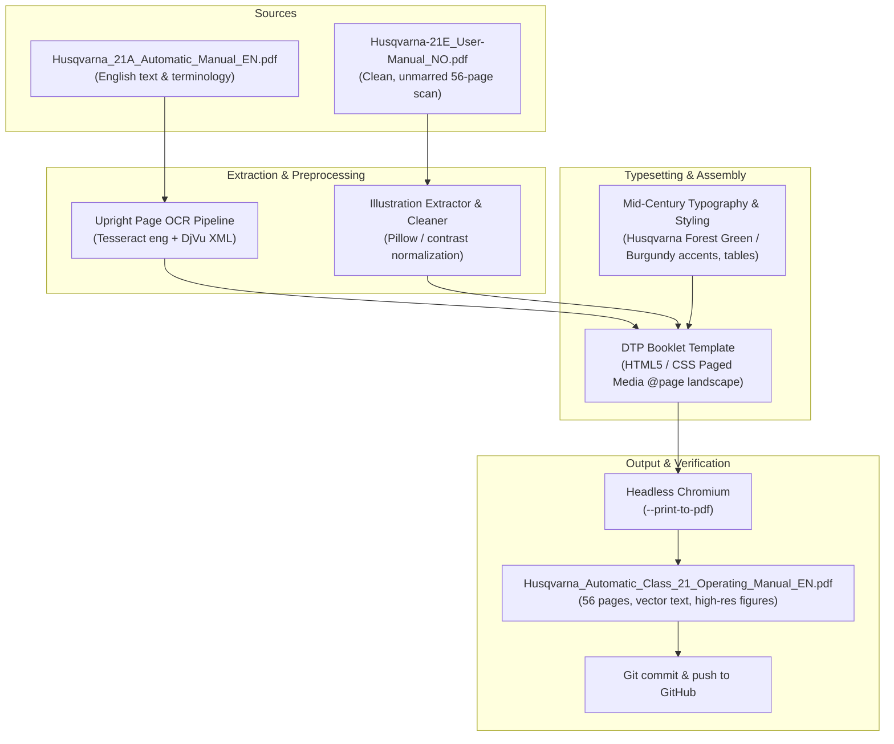

# Implementation Plan: Husqvarna Automatic Class 21 English Operating Manual (Landscape Booklet)

Reconstruct the complete 56-page **Husqvarna Viking Automatic Class 21 / 21A / 21E Operating Manual** in the authentic **horizontal booklet format (~A5 landscape, 56 pages)** in English. The document will be fully typeset with vector typography and clean, cropped illustrations—giving it the appearance and quality of an original factory-printed manual rather than a scan.

---

## User Review Required

> [!IMPORTANT]
> - **Format Alignment**: The final manual will be a 56-page landscape booklet (~210 × 148 mm), matching the exact page count, flow, and foldouts of the original Husqvarna Class 21 physical user manual.
> - **Hybrid Sourcing**: 
>   1. **Illustrations**: Extracted and cropped from the pristine Norwegian scan (`Husqvarna-21E_User-Manual_NO.pdf`), which is completely free of handwriting, pen marks, and skew.
>   2. **Text & Callouts**: 100% authentic English copy from `Husqvarna_21A_Automatic_Manual_EN.pdf` (with all factory part names and technical terms).
> - **Deliverables**:
>   - Standalone HTML/CSS booklet: `Husqvarna_Automatic_Class_21_Operating_Manual_EN.html`
>   - High-resolution vectorized PDF: `Husqvarna_Automatic_Class_21_Operating_Manual_EN.pdf`
>   - Git repository synchronization with `husqvarna-21-manuals` on GitHub.

---

## Proposed Pipeline & Architecture



---

## Detailed Step-by-Step Execution Plan

### Step 1: Automated Image Extraction & Cleaning
1. Crop and isolate all individual figures from `scratch/no_render/` (pages 1–56):
   - **Front/Back Covers**: Vintage cover styling and branding.
   - **Machine Schematics (Fig. 1 & Fig. 2)**: Full front and rear perspective foldouts with numbered callouts (1–40).
   - **Threading & Bobbin diagrams**: Winding, threading paths, tension disks, bobbin case insertion.
   - **Needle, Fabric & Stitch charts**: Drop-feed positions, stitch width/length dials, reduction gear lever.
   - **Stitch Cam Diagrams (A, B, C, D)**: Automatic stitch profiles and pattern wheels.
   - **Presser feet & specialty accessories**: Hemmer, buttonhole foot, twin-needle foot, raised-seam guide, darning foot.
2. Normalize white balance and sharpen edges using Pillow (remove yellowing/grain while preserving fine line-art).
3. Save cropped assets into `/home/qba/Dokumenty/images_manual_en/`.

### Step 2: Text Extraction & Editorial Verification
1. Run page-by-page upright OCR on the English manual using `tesseract -l eng` and cross-reference with `Husqvarna_21A_djvu.xml`.
2. Map the text to the 56 pages of the standard booklet structure:
   - Page 1: Cover (Viking Husqvarna Automatic Class 21 / 21A).
   - Page 2: Inside Front Cover ("Important points to remember", Needle system 705 / 15x1).
   - Page 3: Foreword / Welcome message & factory introduction.
   - Page 4: Accessories and standard equipment list.
   - Page 5: Needle and thread chart (fabrics, needle sizes 60–110, thread sizes).
   - Pages 6–10: Connecting motor, foot control, bobbin winding, threading upper thread, bobbin insertion.
   - Pages 11–15: Thread tension adjustments, stitch length, reverse sewing, drop feed.
   - Pages 16–22: Straight and zigzag sewing, needle positions (L, C, R), twin needles.
   - Pages 23–32: Automatic stitch mechanism (cams A, B, C, D), blind hems, decorative embroidery.
   - Pages 33–42: Practical sewing applications: buttonholes, buttons, zippers, darning, hemming, gathering.
   - Pages 43–49: Maintenance: cleaning, oiling, reduction gear (extra slow speed), motor belt tension.
   - Page 50: Troubleshooting chart ("Faults and How to Remedy Them").
   - Page 51: Service, guarantee & dealer information.
   - Page 52: Back cover.
   - Pages 53–56: Two-page Machine Diagram foldouts (Fig. 1 Front, Fig. 2 Rear, and numerical callout key 1–40).

### Step 3: Typeset HTML5 / CSS Booklet Layout
1. Implement clean print-ready CSS:
   ```css
   @page {
     size: 210mm 148mm landscape; /* standard A5 landscape booklet */
     margin: 0;
   }
   .page {
     width: 210mm;
     height: 148mm;
     page-break-after: always;
     box-sizing: border-box;
     padding: 10mm 12mm 8mm 12mm;
     position: relative;
     font-family: 'Inter', 'Liberation Sans', sans-serif;
     color: #222;
     background: #ffffff;
   }
   ```
2. Recreate mid-century Husqvarna visual identity:
   - Husqvarna classic forest green (`#1e4d2b`) and Swedish red accents.
   - Clean tabular layouts with neat borders for needle/thread guides and cam settings.
   - Page headers and footers with authentic page numbering (pages 2 through 52).
   - Two-column reading layout where appropriate to match the physical booklet readability.

### Step 4: PDF Compilation & Quality Inspection
1. Compile HTML to PDF using Chromium:
   ```bash
   chromium --headless --no-sandbox --disable-gpu --print-to-pdf-no-header \
     --print-to-pdf=/home/qba/Dokumenty/Husqvarna_Automatic_Class_21_Operating_Manual_EN.pdf \
     /home/qba/Dokumenty/Husqvarna_Automatic_Class_21_Operating_Manual_EN.html
   ```
2. Render sample pages using `pdftoppm` to inspect margins, image placements, typography, and foldouts.
3. Validate searchable text and page count (exact 56 pages).

### Step 5: Repository Integration & Delivery
1. Move the final HTML, CSS, images, and compiled PDF to `/home/qba/Dokumenty/husqvarna-21-manuals/`.
2. Update `README.md` to document the newly added English Operating Manual alongside the Polish Service Manual.
3. Commit and push changes to GitHub (`git push origin main`).

---

## Verification Plan

### Automated Checks
- Verify PDF page count equals exactly 56 pages:
  `pdfinfo /home/qba/Dokumenty/Husqvarna_Automatic_Class_21_Operating_Manual_EN.pdf | grep Pages`
- Verify searchable text exists throughout the PDF:
  `pdftotext /home/qba/Dokumenty/Husqvarna_Automatic_Class_21_Operating_Manual_EN.pdf - | wc -w` (expect > 8,000 words).
- Verify all image assets load with HTTP 200 / file existence without broken image icons.

### Visual Checks
- Render sample pages (Cover, Table, Stitch Cam Guide, Schematics Fig. 1 & 2) via `pdftoppm -png` and inspect using `view_file`.
- Check alignment, crispness of vector text, and clarity of line drawings.
